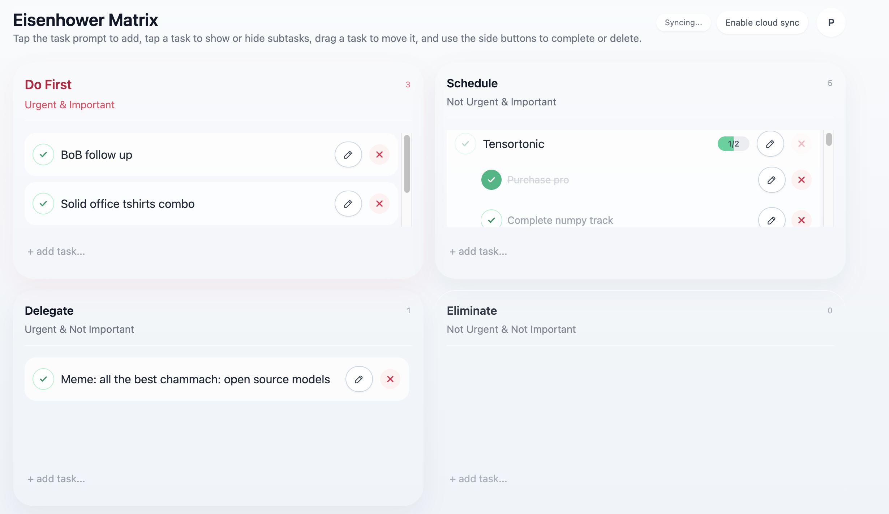

# Prateek Mehra

## Checkout my live projects (I use these daily!)

[Tree of life](https://tree-of-lifee.vercel.app/): My attempt to get an overview of my life from ground up, using first principles.

[Minimal eisenhower](https://minimal-eisenhower.vercel.app/): Simple to-do list app based on the eisenhower matrix framework. 

## Core Projects

### [jalLijiye](https://github.com/prateek-mehra/jalLijiye)

Context-aware hydration reminder system using real-time object detection. 

- Detects presence of person and water bottle
- Tracks interaction and inactivity windows
- Rule-based alert triggering logic
- Designed for lightweight edge deployment

## Engineering Focus

- Real-time perception systems
- Edge ML optimization
- Benchmark-driven engineering
- Production ML pipelines

---

## Stack

Python | C++ | Docker | Linux | AWS | GCP  
Experience with Kubernetes, Postgres, system-level debugging, and cloud-native ML systems.

---

## Contact

LinkedIn: https://www.linkedin.com/in/1prateekmehra1/  
Email: partumehra@gmail.com
